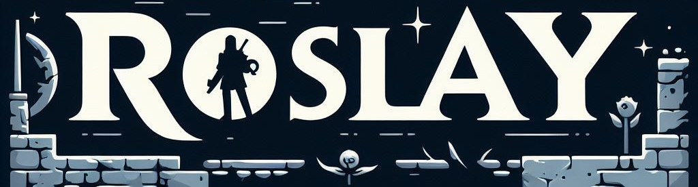

<a name="readme-top"></a>

<!-- PROJECT LOGO -->
<br />
<div align="center">
  <a href="https://github.com/kaylaa0/roslay">
    
  </a>
  <p align="center">
    <h3 align="center">Roslay</h3>
    <a href="https://github.com/kaylaa0/roslay/wiki"><strong>Explore the docs »</strong></a>
    <br />
    <br />
    <a href="https://github.com/kaylaa0/roslay">View Demo</a>
    ·
    <a href="https://github.com/kaylaa0/roslay">Report Bug</a>
    ·
    <a href="https://github.com/kaylaa0/roslay">Request Feature</a>
  </p>
</div>

<!-- TABLE OF CONTENTS -->
<details>
  <summary>Table of Contents</summary>
  <ol>
    <li>
      <a href="#about-the-project">About The Project</a>
      <ul>
        <li><a href="#built-with">Built With</a></li>
      </ul>
    </li>
    <li>
      <a href="#getting-started">Getting Started</a>
      <ul>
        <li><a href="#prerequisites">Prerequisites</a></li>
        <li><a href="#installation">Installation</a></li>
      </ul>
    </li>
    <li><a href="#usage">Usage</a></li>
    <li><a href="#roadmap">Roadmap</a></li>
    <li><a href="#contact">Contact</a></li>
    <li><a href="#acknowledgments">Acknowledgments</a></li>
  </ol>
</details>

<!-- ABOUT THE PROJECT -->

## About The Project

Roslay is a multiplayer roguelite dungeon crawler in a 3D world with cooperative play. It features RPG elements like 
diverse items, various classes, and generated dungeons and with 
dynamic rooms.

<center>
  
</center>

Roslay utilizes Unity and C# for development. While the game is still in development, the project is open-source and contributions are welcome. For the multiplayer aspect, Fish-Networking is used.

<!-- BUILT WITH -->

### Built With

* [![C#][C#]][C#-url]
* [![Unity][Unity.com]][Unity-url]
* [![Fish-Networking][Fish-Networking]][Fish-Networking-url]

<!-- GETTING STARTED -->

## Getting Started

### Prerequisites

1. [Unity 2022.3.20f1 or later](https://unity.com/)
2. [Visual Studio 2022 or later](https://visualstudio.microsoft.com/) (or any other C# IDE)

### Installation

1. Clone the repo
   ```sh
   git clone https://github.com/kaylaa0/roslay.git
   ```

2. Open the project in Unity (Package Manager will automatically install the necessary packages)

3. Run the project in Unity (or build the project)

<!-- USAGE GUIDE -->

## Usage

  Refer to the `Wiki` for detailed documentation on the [Controls and Guide](https://github.com/kaylaa0/roslay/wiki/)


<!-- ROADMAP -->

## Roadmap

- [x] Create README.md
- [&ensp;] Migrate dungeon generation algorithm


<!-- LICENSE 
## License

<br />
<div style="display: flex; align-items: center;">
  
  <span style="margin-left: 10px;">This work is licensed under a <a rel="license" href="http://creativecommons.org/licenses/by-nc-nd/4.0/">Creative Commons Attribution-NonCommercial-NoDerivatives 4.0 International License</a>.</span>
</div>
<br />

See `LICENSE.md` for more information.-->

<!-- CONTACT -->

## Contact

Kayla Akyüz - kaylakyuz@gmail.com

Project Link: [GitHub](https://github.com/kaylaa0/generative-panning-with-outpainting)

[![LinkedIn][linkedin-shield]][linkedin-url]

<!-- ACKNOWLEDGMENTS -->
## Acknowledgments


* Thanks to [Kay Lousberg](https://kaylousberg.itch.io/) for the amazing 3D assets.

<p align="right">(<a href="#readme-top">back to top</a>)</p>

<!-- MARKDOWN LINKS & IMAGES -->

[linkedin-shield]: https://img.shields.io/badge/-LinkedIn-black.svg?style=for-the-badge&logo=linkedin&colorB=0077B5&colorA=0077B5
[linkedin-url]: https://www.linkedin.com/in/-kayla-/
[product-screenshot]: images/screenshot.png
[Unity.com]: https://img.shields.io/badge/Unity-%23000000.svg?style=for-the-badge&logo=unity&logoColor=white
[Unity-url]: https://unity.com/
[C#]: https://custom-icon-badges.demolab.com/badge/C%23-%23239120.svg?style=for-the-badge&logo=cshrp&logoColor=white
[C#-url]: https://dotnet.microsoft.com/en-us/languages/csharp
[Fish-Networking]: https://img.shields.io/badge/Fish--Net-blue?style=for-the-badge&color=47b1cf&logo=data:image/svg%2bxml;base64,PD94bWwgdmVyc2lvbj0iMS4wIiBlbmNvZGluZz0iVVRGLTgiPz4KPHN2ZyB2ZXJzaW9uPSIxLjEiIHhtbG5zPSJodHRwOi8vd3d3LnczLm9yZy8yMDAwL3N2ZyIgd2lkdGg9IjMyIiBoZWlnaHQ9IjMyIj4KPHBhdGggZD0iTTAgMCBDMS4zMzI5MTk4NiAwLjE5MDQxNzEyIDIuNjY2MjI2NDggMC4zNzgxNTczMiA0IDAuNTYyNSBDNC45OSAwLjcwNjg3NSA1Ljk4IDAuODUxMjUgNyAxIEM3LjY4NzUgMy4zMTI1IDcuNjg3NSAzLjMxMjUgOCA2IEM2LjY4NzUgNy44MTI1IDYuNjg3NSA3LjgxMjUgNSA5IEM0LjM0IDkgMy42OCA5IDMgOSBDMyAxMC42NSAzIDEyLjMgMyAxNCBDMS42OCAxNC4zMyAwLjM2IDE0LjY2IC0xIDE1IEMtMC42NyAxNi4zMiAtMC4zNCAxNy42NCAwIDE5IEMxLjY1IDE5IDMuMyAxOSA1IDE5IEM1IDE5LjY2IDUgMjAuMzIgNSAyMSBDOC40MzMzODUxNiAxOS43OTM2NzU0OCAxMC41MDM2NDU4NSAxOC42MTUyMjgxNiAxMyAxNiBDMTMuNjYgMTYgMTQuMzIgMTYgMTUgMTYgQzEzLjcyNDE0MzU2IDIwLjk4NzQzODgyIDExLjkxNDE4MTkzIDIzLjY1ODYyNTE4IDggMjcgQzMuOTM1MzU0ODUgMjguMzU0ODgxNzIgMC4yNTAxNDc4OSAyOC41Mzc2MjU1NSAtNCAyOCBDLTcuMzc1IDI2LjE4NzUgLTcuMzc1IDI2LjE4NzUgLTEwIDI0IEMtMTAuNTE0MzM1OTQgMjMuNTg3NSAtMTEuMDI4NjcxODggMjMuMTc1IC0xMS41NTg1OTM3NSAyMi43NSBDLTEzLjU4NTE1NTE2IDIwLjI4OTU2NzcxIC0xMy45ODk3NDgwMyAxNy45MDI1NDQ0NiAtMTQuNjg3NSAxNC44MTI1IEMtMTQuOTM4ODY3MTkgMTMuNzI1ODIwMzEgLTE1LjE5MDIzNDM3IDEyLjYzOTE0MDYyIC0xNS40NDkyMTg3NSAxMS41MTk1MzEyNSBDLTE1LjYzMDk3NjU2IDEwLjY4ODA4NTk0IC0xNS44MTI3MzQzNyA5Ljg1NjY0MDYzIC0xNiA5IEMtMTUuMzQgOSAtMTQuNjggOSAtMTQgOSBDLTE0LjMzIDguMDEgLTE0LjY2IDcuMDIgLTE1IDYgQy0xNC4zNCA2IC0xMy42OCA2IC0xMyA2IEMtMTIuNzMxODc1IDUuMjE2MjUgLTEyLjQ2Mzc1IDQuNDMyNSAtMTIuMTg3NSAzLjYyNSBDLTkuNTIzNjE5MzYgLTIuMjYzNTc4MjUgLTUuMzgzNDgyNTggLTAuOTAzNzk2MzUgMCAwIFogIiBmaWxsPSIjOTBDNEQ0IiB0cmFuc2Zvcm09InRyYW5zbGF0ZSgxNiwyKSIvPgo8cGF0aCBkPSJNMCAwIEMwLjY4NzUgMi4zMTI1IDAuNjg3NSAyLjMxMjUgMSA1IEMtMC4zMTI1IDYuODEyNSAtMC4zMTI1IDYuODEyNSAtMiA4IEMtMi42NiA4IC0zLjMyIDggLTQgOCBDLTQgOS42NSAtNCAxMS4zIC00IDEzIEMtNS4zMiAxMy4zMyAtNi42NCAxMy42NiAtOCAxNCBDLTcuNjcgMTUuMzIgLTcuMzQgMTYuNjQgLTcgMTggQy01LjM1IDE4IC0zLjcgMTggLTIgMTggQy0yIDIwLjMxIC0yIDIyLjYyIC0yIDI1IEMtNy40NDUzMzUxMyAyNC42MTEwNDc0OSAtMTAuMTI2ODY5NjEgMjIuNzg1MTA0NyAtMTQgMTkgQy0xNi4zMTIwNTU3MiAxNS43NDIxMDMzIC0xNi40NzI0OTM1NyAxMi45Mzc0NDY0MiAtMTYgOSBDLTEyLjAxNzk5NDY2IDEuNjI1OTE2MDQgLTguNTA5OTQ2MzggLTIuMDAyMzQwMzIgMCAwIFogIiBmaWxsPSIjMkEyQzJEIiB0cmFuc2Zvcm09InRyYW5zbGF0ZSgyMywzKSIvPgo8cGF0aCBkPSJNMCAwIEMxLjk4IDAuNjYgMy45NiAxLjMyIDYgMiBDNC4wMiA0Ljk3IDIuMDQgNy45NCAwIDExIEMtMS42NSAxMC42NyAtMy4zIDEwLjM0IC01IDEwIEMtNS4zMTI1IDcuODEyNSAtNS4zMTI1IDcuODEyNSAtNSA1IEMtMi41IDIuMTg3NSAtMi41IDIuMTg3NSAwIDAgWiAiIGZpbGw9IiM3NUJFRDIiIHRyYW5zZm9ybT0idHJhbnNsYXRlKDgsMSkiLz4KPHBhdGggZD0iTTAgMCBDMC42NiAwIDEuMzIgMCAyIDAgQzAuNzI5MzY0OTIgNC45NjcwMjgwNCAtMS4wNDM0MjY4OSA3LjcxODkzOTM3IC01IDExIEMtNS45OSAxMSAtNi45OCAxMSAtOCAxMSBDLTguMzMgOS4zNSAtOC42NiA3LjcgLTkgNiBDLTguMDcxODc1IDUuNTY2ODc1IC03LjE0Mzc1IDUuMTMzNzUgLTYuMTg3NSA0LjY4NzUgQy0zLjQ4MjU0MDY2IDMuMjU1NDYyNyAtMi4wNDU4Mzg5IDIuMTQ4MTMwODQgMCAwIFogIiBmaWxsPSIjOUFDNUQxIiB0cmFuc2Zvcm09InRyYW5zbGF0ZSgyOSwxOCkiLz4KPHBhdGggZD0iTTAgMCBDLTEuNjI1IDUuNzUgLTEuNjI1IDUuNzUgLTUgOCBDLTUuNzUgNi4yNSAtNS43NSA2LjI1IC02IDQgQy0yLjc3Nzc3Nzc4IDAgLTIuNzc3Nzc3NzggMCAwIDAgWiAiIGZpbGw9IiNENUQ1RDYiIHRyYW5zZm9ybT0idHJhbnNsYXRlKDMxLDE4KSIvPgo8cGF0aCBkPSJNMCAwIEMxLjA2MjUgMS44NzUgMS4wNjI1IDEuODc1IDIgNCBDMS42NyA0LjY2IDEuMzQgNS4zMiAxIDYgQy0wLjMyIDUuMzQgLTEuNjQgNC42OCAtMyA0IEMtMyAzLjAxIC0zIDIuMDIgLTMgMSBDLTIuMDEgMC42NyAtMS4wMiAwLjM0IDAgMCBaICIgZmlsbD0iIzQ2QjFDRSIgdHJhbnNmb3JtPSJ0cmFuc2xhdGUoNywxOCkiLz4KPHBhdGggZD0iIiBmaWxsPSIjQTNBM0ExIiB0cmFuc2Zvcm09InRyYW5zbGF0ZSgwLDApIi8+CjxwYXRoIGQ9IiIgZmlsbD0iI0I0QjNBRSIgdHJhbnNmb3JtPSJ0cmFuc2xhdGUoMCwwKSIvPgo8cGF0aCBkPSIiIGZpbGw9IiNDQ0M4QzciIHRyYW5zZm9ybT0idHJhbnNsYXRlKDAsMCkiLz4KPHBhdGggZD0iIiBmaWxsPSIjQkVCOUI1IiB0cmFuc2Zvcm09InRyYW5zbGF0ZSgwLDApIi8+CjxwYXRoIGQ9IiIgZmlsbD0iI0M1QzBCQyIgdHJhbnNmb3JtPSJ0cmFuc2xhdGUoMCwwKSIvPgo8cGF0aCBkPSIiIGZpbGw9IiM2QzZDNkMiIHRyYW5zZm9ybT0idHJhbnNsYXRlKDAsMCkiLz4KPHBhdGggZD0iIiBmaWxsPSIjQTNBM0ExIiB0cmFuc2Zvcm09InRyYW5zbGF0ZSgwLDApIi8+CjxwYXRoIGQ9IiIgZmlsbD0iIzdCN0I3QiIgdHJhbnNmb3JtPSJ0cmFuc2xhdGUoMCwwKSIvPgo8cGF0aCBkPSIiIGZpbGw9IiNDMkMwQzEiIHRyYW5zZm9ybT0idHJhbnNsYXRlKDAsMCkiLz4KPC9zdmc+Cg==
[Fish-Networking-url]:https://fish-networking.gitbook.io/docs